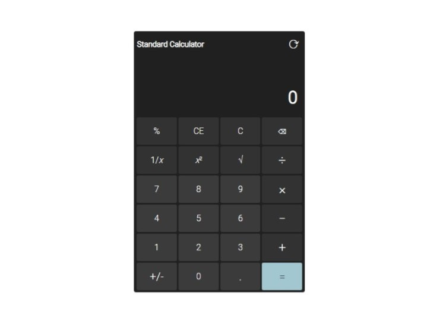
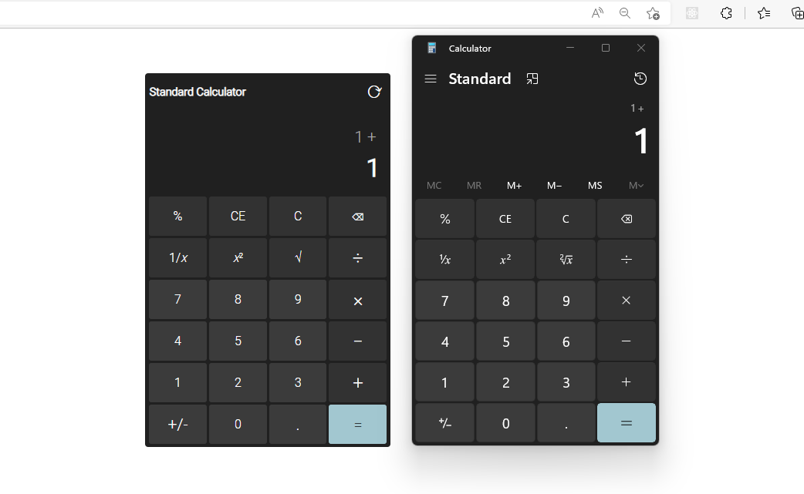
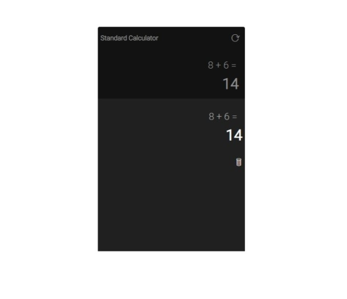

# JavaScript and jQuery Standard Calculator

A web-based application which clones some of the basic features and functionality of the Windows operating system's built-in calculator. This project was built with JavaScript, jQuery, Bootstrap, and CSS.

## Project Screen Shots

Standard Calculator

The standard calculator comes with a variety of functions, which mimics some of the features found on the Windows operating system's built in calculator.

Side to Side Comparison

 clones some of the visual aspects and functionality of the Windows calculator (right).")

This web-based calculator (left) clones some of the visual aspects and functionality of the Windows calculator (right).

Two Line Display

After clicking '1' followed by '+', this web-based calculator clones the display of the Windows operating system's built-in calculator by moving entries to an upper line.

Calculation History

Clicking the circular button in the top right corner will bring up a history of the common types of previous events where a result was rendered. The history is maintained for simple calculation types such as addition, division, multiplication, and subtraction.

## Launch Instructions

Clone or download this repository to your local machine. 

In the file folder, double click on the index.html file. The application will launch in your web browser.

**Please note that this application requires an internet connection.  

## Reflection

When I started this project I wanted to make a simple calculator. After looking over some tutorials on youtube, I found a lot of the JavaScript calculators being made were easy to break (such as by typing repeated/wrong buttons) or otherwise prone to errors. In the end I decided to code my calculator based partially on some of the structure of the SimpliCode Calcuator, but then to modify it greatly by reproducing some of the functionality of the standard calculator found on the Windows operating system to ensure that users can't  circumvent or break the features as easily. 

Similar to the calculator found on the Windows operating system, a history screen is also included, which records the history of the simpler math operations. A two-line display is also provided.
 
## References

- SimpliCode - "Create a Calculator in jQuery | Calculator Using jQuery | jQuery Tutorial | jQuery | SimpliCode" - https://www.youtube.com/watch?v=qF0lECLBMw4 (For guidance on how to structure some of the basic computational logic, however, my application includes a lot more features.)
- W3schools - "How To - Image Overlay Slide" - https://www.w3schools.com/howto/howto_css_image_overlay_slide.asp